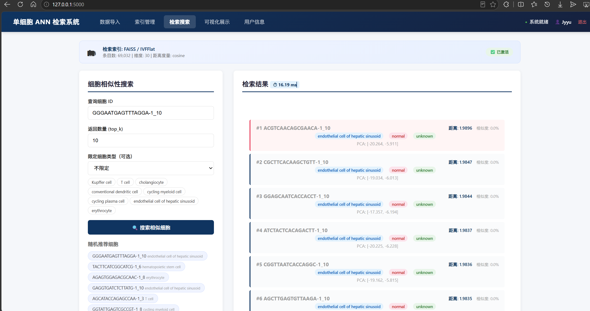

# 单细胞ANN检索系统

南开大学 2025-2026学年 软件工程 第19小组课程作业

## 项目简介

本项目构建一个面向单细胞组学数据的交互式 **ANN（近似最近邻，Approximate Nearest Neighbor）检索系统**。系统以单细胞表达矩阵为核心，支持数据导入、预处理、降维、ANN索引构建、Top-K相似细胞查询与结果可视化，提供完整的 Web 交互界面。

单细胞组学数据规模大（可达数十万细胞 × 数万基因），传统精确检索在高维海量场景下面临查询效率低、响应时间长、计算资源消耗大等问题。ANN 技术能在保证较高检索精度的前提下显著加速查询，广泛用于图像检索、推荐系统等场景，同样适合单细胞数据分析。

## 技术栈

| 类别 | 技术 | 说明 |
|------|------|------|
| 后端框架 | Flask 3.x | Web 应用框架，Jinja2 模板引擎 |
| ANN 检索引擎 | FAISS / scikit-learn / HNSWLIB | 三后端可选，FAISS 为主力（支持 Flat/IVFFlat/IVFPQ/HNSWFlat） |
| 单细胞数据 | AnnData (anndata) | .h5ad 格式数据读写，PCA/UMAP/t-SNE 降维提取 |
| 科学计算 | NumPy / SciPy / pandas | 向量矩阵运算、数据预处理（CPM 归一化 + log1p 变换） |
| 前端可视化 | Canvas API | PCA 降维散点图、相似度分布柱状图、细胞类型统计 |
| 用户认证 | bcrypt | 密码哈希，JSON 文件持久化 |
| 版本管理 | Git + GitHub | 多分支协作（A/B/C/D 模块分支） |

## 数据集

[单细胞组学数据集](https://www.ncbi.nlm.nih.gov/geo/query/acc.cgi?acc=GSE119098)

## 我的实现说明：

初步完成C模块需要完成的任务，同时对项目框架做了初步搭建，为了防止C模块与项目的实际使用对接出现问题，简单做了一个初始化的小项目以确定C模块可行，具体操作run.py即可，成果如下，后续小组成员开发可供参考

